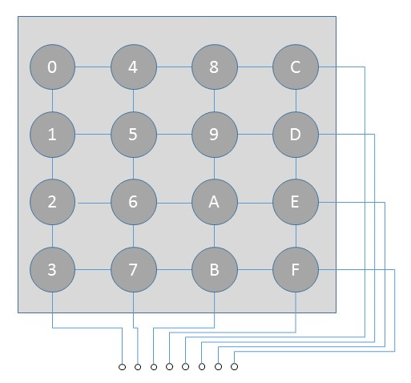
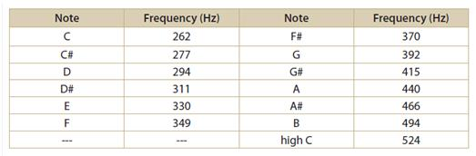
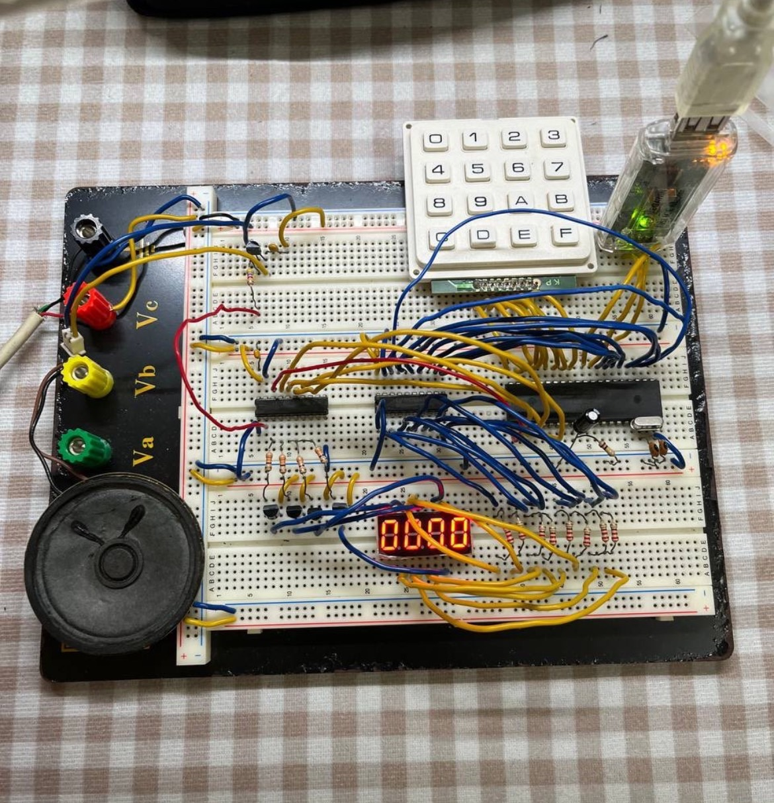

# Simple-Eletric-Piano
It's final project for 1112 NCNU CSIE "Microcomputer System Lab"

## What I did
I have implemented a simple electric piano , capable of playing music. Self-customizable function keys that can be recorded into the eXpanded RAM of the MPC82G516, playing back N notes (including pitch and beat).

Main Components:
MCU(MPC82G516A), IC Programmer, Mini Speaker, 7-segment display, 4x4 Keypad, Breadboard

4x4 Keypad pinout:

pitch:

Results Display:
 

